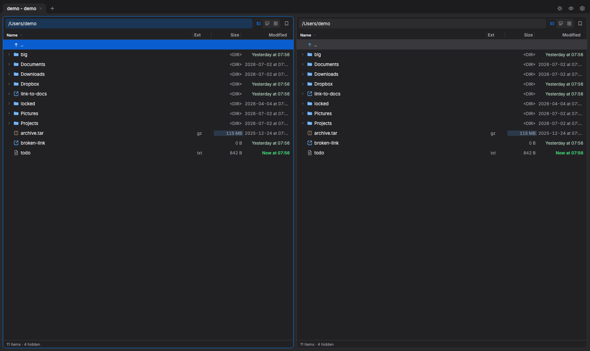

# Delight Commander

A Total Commander–style **dual-pane file manager** that tries to live up to its
name: fast, keyboard-first, no jank, with its own clean design (not a native
look-alike).



## Download

- [**macOS** (Apple silicon)](https://github.com/mtrencseni/delight/releases/latest/download/Delight-macos_arm64.dmg)
- [**Windows** (x64)](https://github.com/mtrencseni/delight/releases/latest/download/Delight-win_x64-portable.exe)

## Features

**Browsing**
- Two independent panes with tabs (drag to reorder, middle-click to close), or a
  single wide pane with **⌘P**.
- Three views per pane — **List** (sortable, resizable, reorderable columns),
  **Chips** (the cursor item expands into a detail card), **Icons** (a grid with
  marquee selection) — on **⌘⇧L / ⌘⇧C / ⌘⇧I**.
- Folders expand in place with a disclosure triangle, so you can inspect a
  subtree without leaving the pane.
- Editable path bar with recent-path autocomplete (**⌘L**). Open folders
  auto-refresh when they change on disk.
- Column order and widths are **one global spec** — reorder or resize anywhere
  and every pane and tab follows.

**Finding & selecting**
- **⌘F** jumps to the first matching name and cycles through matches, without
  filtering the listing — you keep the context around the file.
- **Shift-click** for a range, **⌘-click** to toggle, **⇧↑/↓** to extend,
  **⌘A** to select all (or deselect, if something is selected).
- **+** / **−** select or deselect by wildcard mask (`*.png`).

**Looking at files**
- **Space** previews in the opposite pane: images as thumbnails, text and code
  in a real read-only editor with syntax highlighting, line numbers, a minimap
  and find — the same editor its sibling app
  [Buffers](https://github.com/mtrencseni/buffers) uses. PDFs render as real
  documents. The preview follows the cursor and survives folder changes.
- Optional **preview icons**: real content thumbnails in list and icon views.
- On macOS, the system Quick Look panel instead, if you prefer it.

**Acting on files**
- Copy, move, rename, new folder, and delete on the Commander keys — **F5 / F6 /
  ⇧F6 / F7 / F8** (macOS: **5 / 6 / ⇧6 / 7 / 8**). Destructive actions are
  confirmed by default, long ones show cancelable progress, and **delete means
  Trash** — there is no hard-delete path.
- **Drag files out** into Finder, Explorer, Mail or any app — always a copy,
  never a move.
- **⌘I** opens Finder's Get Info window for the cursor item (macOS).

**Archives**
- Browse **zip** (and jar/apk/docx…), **7z**, **tar** and its compressed forms
  (gz, bz2, xz, zst) as if they were folders; **F5** copies files back out.
  Encrypted zips prompt for a password, and a wrong one is never cached.
- **Alt+F5** packs the selection into a zip, **Alt+F9** unpacks an archive.

**Network locations**
- **SFTP** — `sftp://user@host/path`, spoken over your system `ssh`, so
  `~/.ssh/config`, agent keys, `known_hosts` and ProxyJump all work as they
  already do in your terminal.
- **SMB** — `smb://server/share`, over UNC on Windows and mounted through NetFS
  on macOS. One portable address form means a favorite saved on one platform
  works on the other.
- The globe button in the path bar builds either address for you, with a live
  preview and your recent servers.

**From a browser**
- **`delight-server`** puts the same interface in front of a machine you aren't
  sitting at: run it on the box, open it in Chrome, and both panes show *that*
  machine's filesystem. Copy, move, rename and delete work over there as they do
  here; **⌘⇧U** uploads into the current folder and **⌘⇧S** downloads the
  selection, which is the one axis the desktop app doesn't have.
- **It's a server, so it's fenced like one.** Every path from the browser goes
  through a single check that resolves symlinks *before* testing them against
  the allowed roots; roots default to the home directory of the user running it,
  never `/`; and `DELIGHT_READ_ONLY=1` refuses every mutating request. Access is
  a shared token traded once for a signed, HttpOnly cookie — rotate the token and
  every browser is logged out.
- It's built from source, not shipped in the downloads above, and it needs no
  webview — the desktop binary and the server are separate crates over one
  shared core.

**Making it yours**
- **Every** shortcut is rebindable in a Shortcuts tab; **⌘K** draws a keyboard
  of the current bindings, and holding a modifier switches layers.
- **⌥S** — the newest file on the Desktop: jumps there, sorts newest first,
  selects it and previews it. Made for take-a-screenshot-then-drag-it-somewhere.
- Favorites per pane (**⌘1** / **⌘2**), keyboard-navigable and drag-reorderable.
- Light / dark / system themes, browser-style zoom, show/hide hidden files, size
  bars, recency tint, and name casing.

## Keyboard shortcuts

All shortcuts are rebindable in **Settings → Keyboard → Configure shortcuts**,
and **⌘K** shows them on a drawn keyboard. Defaults (on Windows, read every
**⌘** as **Ctrl**):

| Keys | Action |
| --- | --- |
| ⌘T / ⌘W | New / close tab _(Windows also Ctrl+F4)_ |
| ⌘⇧[ · ⌘⇧] · ⌃⇥ · ⌘` | Switch / cycle tabs |
| ⌘⇧L / ⌘⇧C / ⌘⇧I | List / Chips / Icons view |
| ⌘P | Single-pane ↔ dual-pane |
| ⌘L | Focus the path bar |
| ⌘, | Settings |
| Tab | Switch active pane |
| ↑ ↓ · PgUp PgDn · Home End · ⌘↑ ⌘↓ | Move cursor / jump to top / bottom |
| ⌘→ / ⌘← | Expand / collapse folder |
| → / ← | Next / previous recent folder |
| Enter · double-click | Open (folder or default app) |
| Backspace | Go up a folder |
| ⌘F | Find in pane |
| ⇧→ / ⇧← · ⇧↑ / ⇧↓ · ⌘A | Select / deselect · extend · select all |
| + / − | Select / deselect by mask |
| **F5 / F6 / ⇧F6 / F7 / F8** | Copy / Move / Rename / New folder / Delete _(macOS: 5 / 6 / ⇧6 / 7 / 8)_ |
| Alt+F5 / Alt+F9 | Pack to zip / unpack _(macOS: ⌥5 / ⌥9)_ |
| ⌘⏎ | Open archive as a folder |
| Space · F3 | Preview _(macOS: Space · 3)_ |
| ⌥S | Newest file on the Desktop |
| ⌘I | Get Info in Finder _(macOS)_ |
| ⌘1 / ⌘2 | Favorites — left / right pane |
| **Alt+F1 / Alt+F2** | Drive picker for the left / right pane _(Windows)_ |
| ⌘N ⌘E ⌘S ⌘C ⌘M | Sort by name / ext / size / created / modified |
| ⌘+ ⌘− ⌘0 | Zoom in / out / reset |
| ⌘⇧. | Show / hide hidden files |
| ⌘K | Keyboard map |
| ⌥⌘I | Developer tools (when enabled) |
| **⌘⇧U / ⌘⇧S** | Upload here / download the selection _(browser only)_ |

## Platform support

**macOS and Windows** both build and run. Previews and thumbnails work on both
(Windows via the Shell's image factory), drives are reachable with the Alt+F1/F2
picker, and ⌘ shortcuts map to Ctrl. The server build is headless — no webview,
so it runs on a Linux box that has no desktop at all. The few macOS-only niceties — the
standalone Quick Look panel, system file icons in list and grid, the global menu
bar — degrade gracefully to the vector icons and the in-pane preview; the app
looks and behaves the same otherwise. Linux is not yet built, but the code is
fenced for it.

## Development

The downloads above are the built app; this section is for working on it.
Requires [Node](https://nodejs.org) + [pnpm](https://pnpm.io) and the
[Rust toolchain](https://www.rust-lang.org/tools/install).

```sh
pnpm install
pnpm tauri dev      # the native app, with hot-reload
pnpm dev            # browser-only UI against a mock filesystem (no native shell)
pnpm tauri build    # a distributable app bundle
./node_modules/.bin/tsc            # typecheck
cd src-tauri && cargo check && cargo test
```

To run the browser version, build the frontend and start the server — it serves
the same bundle it talks to:

```sh
pnpm build
cd server && DELIGHT_TOKEN=<a long random string> cargo run --release
```

It listens on `127.0.0.1:8787` by default. `DELIGHT_ROOTS` limits what it will
serve (default: the home directory of the user running it) and
`DELIGHT_READ_ONLY=1` makes it refuse every mutating request.

The code preview reuses [Buffers](https://github.com/mtrencseni/buffers)' editor
verbatim, so **both repos must be checked out side by side** — `src/langs.ts` and
`src/editor-core.ts` re-export from `../../Buffers/src/`.

Releases are cut by pushing a `v*` tag: CI builds and publishes the Windows
binary, and the macOS build is attached from a Mac. See [CLAUDE.md](CLAUDE.md).

## Tech

Tauri 2 (Rust backend + WKWebView on macOS / WebView2 on Windows) with a vanilla
TypeScript / Vite frontend. All filesystem access goes through Rust commands —
the webview never touches the disk.

- [PRODUCT.md](PRODUCT.md) — what the product is, who it's for, and what it
  deliberately isn't.
- [ARCHITECTURE.md](ARCHITECTURE.md) — how it's put together and why.
- [CLAUDE.md](CLAUDE.md) — working notes: per-platform status, where each OS
  difference lives, and the release checklist.
